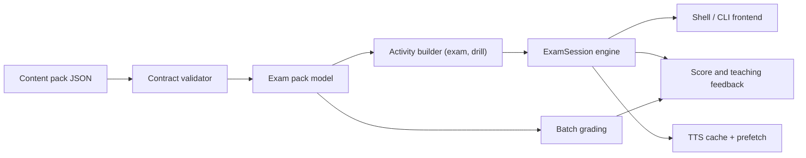

# Architecture

The simulator is organized around a stable content contract and a small core runtime. `docs/FRAMEWORK.md` describes the extension points in detail.

## Layers

- Frontends: classic CLI flows (`cli.py`) and the interactive shell (`ui/`), both driving the same engine.
- Session engine: `session.ExamSession` runs present → submit → advance → finalize and saves after every answer.
- Activities: attempt builders (`exam`, `drill`) that select and order questions.
- Question types: pluggable validate/grade specs in `question_types.py`.
- Content loading: JSON parsing and contract validation.
- Grading and feedback: scoring plus teaching-oriented summaries.
- TTS and audio cache: local Korean synthesis with a content-addressed WAV cache, LRU pruning, warming, and background prefetch (`docs/AUDIO_DESIGN.md`).

## Data Flow

## Design Choice

The core uses Python standard-library modules only, so the project runs in a clean workspace and the content contract stays visible. `prompt_toolkit` is an optional enhancement for the shell input line; every frontend degrades to plain `input()` when it is missing.
