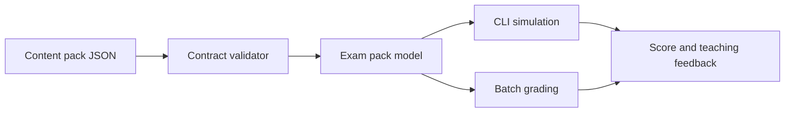

# Architecture

The simulator is organized around a stable content contract and a small core runtime.

## Layers

- CLI: command parsing and user interaction.
- Content loading: JSON parsing and contract validation.
- Grading: answer normalization, scoring, and correctness.
- Feedback: teaching-oriented response summaries.

## Data Flow

## Design Choice

The first version uses Python standard-library modules only. This makes the project easy to run in a clean workspace and keeps the content-authoring contract visible.

Future changes can add:

- Rich terminal UI.
- Local web UI.
- Audio handling for listening sections.
- Spaced repetition and learner history.
- Optional AI-assisted feedback for written responses.

